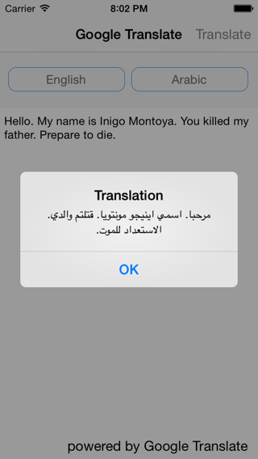

GoogleTranslationAPI v0.1
====================

GoogleTranslationAPI is an Objective-C wrapper for calling the Google Translate API.

How to use:
------------

Instantiate a GTTranslationAPI with your Google Translate API Key:

    GTTranslationAPI *translateAPI = [[GTTranslationAPI alloc] initWithApiKey:@"<YOUR KEY>"];

Then call its translate method:

    [translationAPI translateText:@"Hello. My name is Inigo Montoya. You killed my father. Prepare to die."
              usingSourceLanguage:nil
              destinationLanguage:[[GTLanguage alloc] initWithLanguageCode:@"es"]
            withCompletionHandler:^(NSArray *translations, NSError *error) {
                  if (error) {
                     NSLog(@"error: %@", error);
                  } else {
                     NSLog(@"translations: %@", translations);
                  }
    }];

This library includes all v2 supported API calls:

 - Translate
 - Detect Language
 - Get Supported Languages

How To Add To Your Project
-----------------------------
 1. Clone or download this project.
 1. Find the GoogleTranslate project file
 1. Drag and drop into Xcode, adding this as a subproject to your app.
 1. In the project settings of your app, link libGoogleTranslate to your application.
 
Dependencies
-------------
GoogleTranslationAPI currently has a dependency on [AFNetworking 2.0](https://github.com/AFNetworking/AFNetworking).  The headers are included in the project for compiling, but you will need to add AFNetworking library to your project.
 
How to setup your API key
--------------------------

Setting up your API key involves several steps:

### Generating a Key ###

 1. Log into your Google account.
 1. Got to [https://cloud.google.com/console](https://cloud.google.com/console)
 1. Create a new project.
 1. In the "APIs & auth" section click on "APIs", then active "Translate API".
 1. In the "APIs & auth" section click on "Credentials" and click on "Create New Key"
 1. Select "Browser Key" from the pop up and add your application bundle ID as the referrer. The reason why we are doing this instead of generating an iOS key is because iOS and Android are currently broken.  This project will be updated when it has been fixed by Google.

At this point the only method you can call is the `languages` API.  This is because you will need to setup billing.  When this project was created the pricing was as follows:

 > $20 per 1 M characters of text, where the charges are adjusted in proportion to the number of characters actually provided. For example, if you were to translate 500K characters, you would be billed $10.
 
 For the most up to date information on billing, please visit [Pricing for Google Translate](https://developers.google.com/translate/v2/pricing).
 
### Setting Up Billing ###

 1. Click on the "Settings", then "Billing", and then select your project.
 1. Select the "Profile" tab and enter the billing details.
 1. Once you have successfully entered your details, go make a sandwich.  Seriously.  The verification email can take a while to reach your inbox and you cannot proceed until you have verified.
 1. After the verfication email arrives, click on the link enclosed.
 1. Tada! You are now activated and ready to start making calls.

TODO
------
 
  - Unit tests
  - Refactoring
 
License
---------

BSD:  Please see LICENSE file for full details.

Use of the Google Translate API is covered by additional [terms and conditions](https://developers.google.com/translate/v2/terms). 
